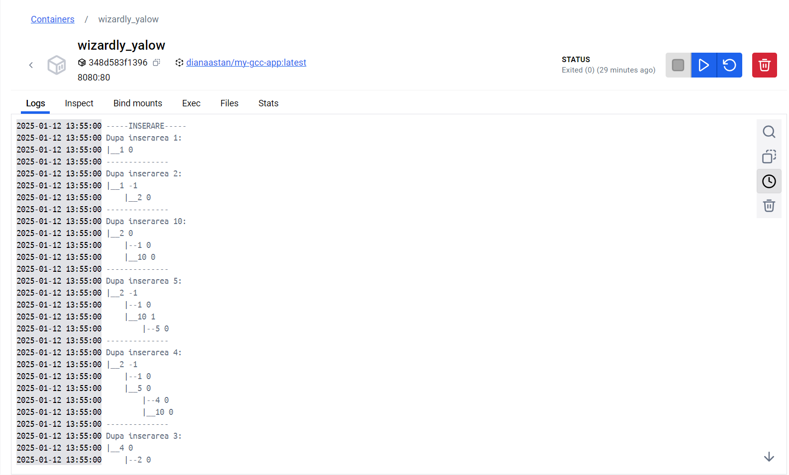
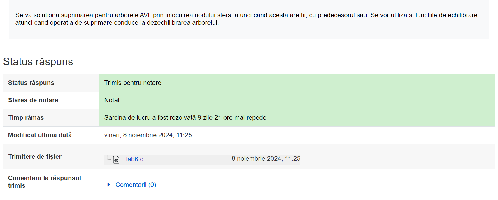

# Proiect-Sincretic-2024

## Autor
**Stan Diana**

## Notite
## Cerinta Proiectului ales:

**21. Traversarea arborilor AVL**
Se dă un arbore AVL care se populează cu elemente
aleatorii. Să se afișeze elementele în urmă traversării arborelui în:
- „pre-ordine”
- „in-ordine”
- „post-ordine” 
- „nivel” (level-order traversal).

---


## Descriere
Acesta este un proiect care implementeaza un arbore AVL in limbajul **C**.


---


## Platforma Software Utilizata
- Limbaj de programare: **C**
- Sistem de operare: **Windows 11** (proiectul poate fi rulat si pe alte sisteme de operare folosind GCC sau orice alt compilator C)
- Compilator utilizat: **GCC(v14.2.0)**
- IDE recomandat:  **Visual Studio Code**, sau orice editor preferat pentru C(proiectul este realizat in Visual Studio Code)


---


## Modalitate de rulare 

### Rulare locala
Pentru a compila si rula proiectul, urmeaza pasii:

1. Descarca sau cloneaza repository-ul:
```bash
  git clone: <https://github.com/DianaaStan/Proiect-Sincretic-2024.git>
```

 2. Compileaza fisierul myapp.c:
 ```bash
 gcc myapp.c -o myapp
 ```

 3. Ruleaza aplicatia: 
```bash 
./myapp
```


---


### Cum sa rulezi aplicatia folosind Docker:

Aceasta aplicatie este disponibila ca imagine Docker pe Docker Hub. Puteti accesa repository-ul Docker aici:
[My GCC App - Docker Hub](https://hub.docker.com/repository/docker/dianaastan/my-gcc-app/general?editDescription=true)

 ## Pasi de utilizare:

1. Cloneaza repository-ul
- Utilizati comanda:
```bash
git clone https://github.com/dianaastan/my-gcc-app.git
```
2. Acceseaza directorul proiectului:
```bash 
cd my-gcc-app
```

3. Construieste imaginea Docker:
```bash 
docker build -t dianaastan/my-gcc-app:latest
```

4. Ruleaza containerul Docker:
```bash 
docker run -it --rm dianaastan/my-gcc-app:latest
```

---


 ## Rezultate

 - Captura de ecran a aplicatiei rulate cu comanda `docker run dianaastan/my-gcc-app:latest` in terminal : 
 

 - Captura de ecran cu aplicatia rulata intr-un  container Docker : 
 


---


 ## Bibliografie:

 1. **GeeksforGeeks - AVL Tree** - [https://www.geeksforgeeks.org/avl-tree-set-1-insertion/](https://www.geeksforgeeks.org/avl-tree-set-1-insertion/)
 
 2. **GeeksforGeeks - Level Order Traversal of Binary Tree** - [https://www.geeksforgeeks.org/level-order-tree-traversal/](https://www.geeksforgeeks.org/level-order-tree-traversal/)

 3. **GCC - GNU Compiler Collection** - [https://gcc.gnu.org/](https://gcc.gnu.org/)

 4. **AI (ChatGPT, BlackBox)**

 5. **Cursul si Laboratorul de Analiza Algoritmilor** 

 - [Documentatie 1(PDF)](docs/teorie.pdf)
 - [Documentatie 2(PDF)](docs/AA%20S6.pdf)

 *De asemenea am realizat un program asemanator la laborator pe care am primit si nota*
 